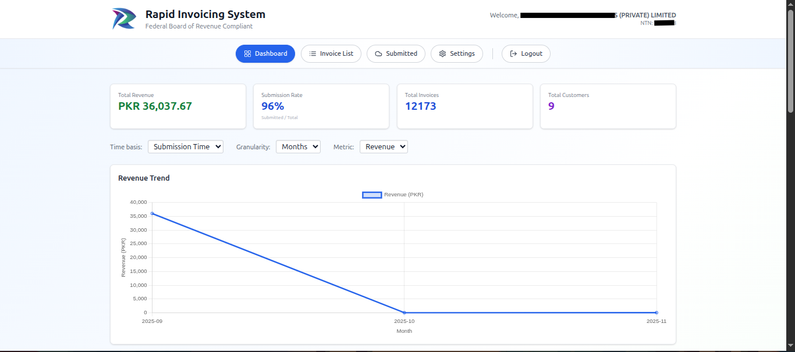

# Rapid Invoicing System

Rapid Invoicing is a student-developed, full-stack prototype demonstrating integration with Pakistan's Federal Board of Revenue (FBR) API for invoice validation and submission. It is a personal learning project and is not intended for production financial use.



---

## What this repository contains

- Source for a web frontend and a backend API that demonstrate invoice creation, validation, and submission to the FBR API.
- Example screenshots and sample data for demonstration; the screenshots show client-specific or example datasets, not global usage metrics.
- Basic operational tooling and documentation to run the prototype in a small-scale environment.

---

## What it does

- Integrates with the FBR API to submit invoices and receive FBR invoice numbers
- Generates printable invoices (PDF) with QR codes
- Bulk import of invoices from Excel/CSV for faster entry
- Server-side validation and simple duplicate detection
- Lightweight role-based access control (Admin / Finance / Viewer)

---

## Screenshots

- Landing page: ./images/01-landing-page.png
- Analytics dashboard: ./images/02-analytics-dashboard.png
- Invoice creation (steps): ./images/03-create-invoice-step1-details.png, ./images/04-create-invoice-step2-buyer.png, ./images/05-create-invoice-step3-items.png
- Invoice management and history: ./images/07-invoice-management-list.png, ./images/08-submitted-invoices-history.png
- Print / PDF examples: ./images/09-invoice-print-top.png, ./images/10-invoice-print-bottom.png
- Pricing mockup: ./images/11-pricing-plans.png

Images are included as visual proof of the UI and flows; numbers shown in the screenshots are client- or demo-specific.

---

## Architecture (simplified)

```
 	React frontend  <---->  PHP backend API  <---->  MySQL database
 					|
 					+----> FBR API (invoice submission)
 					+----> Email service (SMTP)

```

This diagram intentionally shows only the components implemented in the repository. Hosting providers may offer infrastructure services (TLS termination, backups); verify provider policies before deploying.

---

## Tech stack

- Frontend: React + TypeScript, Vite, Tailwind CSS
- Backend: PHP (REST API)
- Database: MySQL
- Other: Email (SMTP), QR/PDF generation libraries

---

## Usage notes

- Designed to simulate features commonly found in invoicing systems. Screenshots show example or client-specific datasets and should not be treated as global metrics.
- Demo site: https://rapid-invoicing.com (author's demo deployment)

---

## Security (brief)

The project includes baseline security measures implemented by the author for practical use. It has NOT undergone external certification or third-party penetration testing.

Implemented (examples):
- Token-based authentication and session handling
- Password hashing and account controls
- Server-side input validation and basic rate limiting
- Secrets stored via environment variables (no hardcoded credentials)
- Basic audit logging for important operations (e.g., invoice submission)

## Limitations

- Built as a portfolio and learning project; not intended for production financial use.
- Does not include automated testing, cloud deployment scripts, or compliance workflows.
- External security assessments, production monitoring, and managed backups are out of scope for this repository.

If you plan to deploy this code in a regulated or production environment, obtain an independent security assessment and implement appropriate operational controls before relying on it.

---

## Documentation

- [docs/SECURITY.md](docs/SECURITY.md) — honest summary of implemented controls and limitations
- [docs/FAQ.md](docs/FAQ.md)
- [docs/TROUBLESHOOTING.md](docs/TROUBLESHOOTING.md)

---

## Roadmap (aspirational)

- Urdu language support
- Mobile app (React Native)
- Analytics and reporting
- Integration with accounting software

These items are planned as future enhancements.

---

## Contact

- Email: support@rapid-invoicing.com
- Live site: https://rapid-invoicing.com

---

## License

MIT — see the LICENSE file

